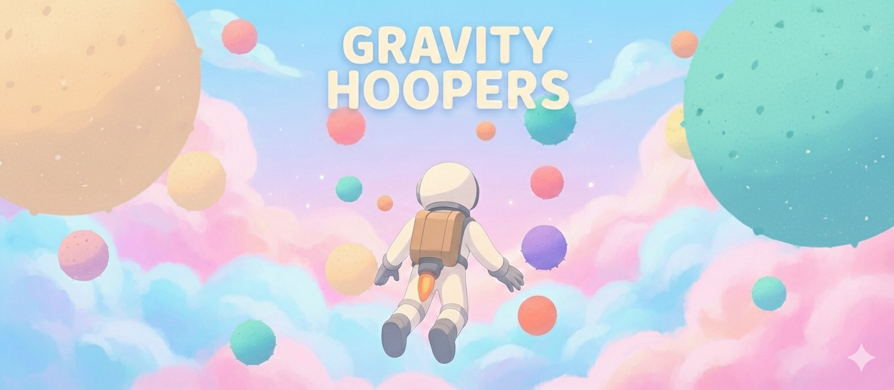

# Gravity Hoopers



A multiplayer 3D space exploration game where players navigate between colorful planets using jetpack thrust, experiencing dynamic gravity from nearby celestial bodies.

## Features

- **Multi-planet system** - Explore a universe filled with planets of varying sizes, from small moons to giant worlds
- **Dynamic gravity** - Feel the gravitational pull of nearby planets as you fly through space
- **Jetpack movement** - Use thrust to propel yourself forward or backward through the void
- **Dreamy pastel aesthetic** - Soft candy-colored planets with atmospheric glow effects against a gradient sky
- **3D radar minimap** - Track nearby planets and players with a stylized radar display
- **Multiplayer support** - See other players exploring the universe in real-time

## Controls

- **Mouse** - Look around
- **Space / Left Click** - Forward thrust
- **S / Right Click** - Reverse thrust
- **Click** - Lock pointer to play

## Tech Stack

### Client
- React + TypeScript
- Three.js via React Three Fiber
- @react-three/rapier for physics
- @react-three/drei for utilities
- @react-three/postprocessing for visual effects

### Server
- Node.js
- Colyseus for multiplayer state management

## Project Structure

```
packages/
├── client/          # React frontend
│   └── src/
│       ├── components/
│       │   ├── Planet.tsx        # Planet with trees, rocks, and glow
│       │   ├── PlanetSystem.tsx  # Planet generation and configuration
│       │   ├── Player.tsx        # Player physics and controls
│       │   ├── Tree.tsx          # Decorative trees
│       │   ├── Rock.tsx          # Decorative rocks
│       │   ├── SkyGradient.tsx   # Gradient sky with clouds
│       │   ├── Minimap.tsx       # 3D radar overlay
│       │   ├── SpeedLines.tsx    # Thrust visual effect
│       │   └── ...
│       ├── hooks/
│       │   ├── useKeyboardControls.ts
│       │   └── useMouseControls.ts
│       └── App.tsx
└── server/          # Colyseus backend
    └── src/
        └── rooms/
            └── GameRoom.ts
```

## Getting Started

### Prerequisites
- Node.js 18+
- npm or yarn

### Installation

```bash
# Install dependencies
npm install

# Start development server (client)
cd packages/client
npm run dev

# Start game server (in another terminal)
cd packages/server
npm run dev
```

### Build

```bash
cd packages/client
npm run build
```

## Visual Style

The game features a soft, dreamy aesthetic inspired by candy pastels:
- Planets come in various pastel colors (baby pink, baby blue, butter cream, lavender, mint, peach, etc.)
- Each planet has a soft atmospheric glow using Fresnel-based shaders
- The sky displays a gradient from pink to blue to lavender with subtle cloud effects
- Post-processing includes bloom and vignette for a polished look

## License

MIT
